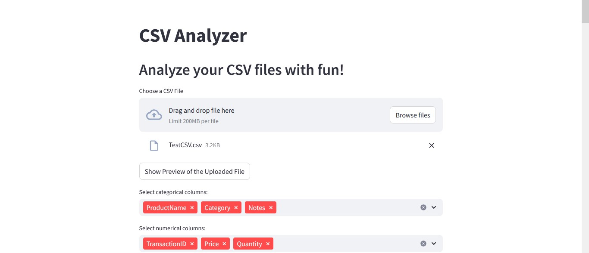

# CSV Data Analysis Hub


<br>
<br>

* CSV Analyzer is a powerful and user-friendly Streamlit application designed to simplify the process of analyzing and visualizing your CSV data.

* Whether you're a data enthusiast, a student, or a professional, this tool provides an intuitive interface to upload, preprocess, and gain insights from your tabular data without writing a single line of code.

<br>

## The Foundation


### Project Overview

Empower your data analysis with interactive visualizations and robust data preprocessing, no coding required!

### Elevator Pitch (The "What" and "Why")

* CSV Analyzer provides a streamlined solution for anyone needing to quickly understand and visualize their CSV datasets.

* It addresses the common challenge of data preparation and exploration by offering intuitive controls for column type specification, comprehensive missing value handling, and dynamic chart generation.

* This tool exists to democratize data analysis, enabling users of all technical levels to extract meaningful insights from their data efficiently and enjoyably, reducing the barrier to entry for data exploration.

### Badge

**License:** [MIT License](https://opensource.org/license/mit)


## Getting Started


### For the Non-Technical User (The "Easy" Button)

All you need to do is to click [CSV Analyzer]()

### For the Technical User (The "Under the Hood" Guide)

To set up the development environment and run the application locally, follow these detailed instructions.

**Prerequisites**
1. Python 3.11.4

**Installation**

Step 1: *Clone the repository (or download the CSV_Analyzer.py file):*

```bash
git clone https://github.com/Asmit-cloud/CSV-Analyzer.git
cd CSV-Analyzer
```

(If you downloaded only the CSV_Analyzer.py file, navigate to the directory where you saved it.)

Step 2: *Install the required Python packages:*

```bash
pip install -r requirements.txt
```
<br>

**Running the Application**

Step 3: Navigate to the directory where CSV_Analyzer.py is saved in your terminal or command prompt.

Step 4: *Run the Streamlit application:*

```bash
streamlit run CSV_Analyzer.py
```

Step 5: Access the application: Your default web browser will automatically open a new tab with the Streamlit app (typically at http://localhost:8501)


## Unveiling the Features


### Key Features (The "Wow" Factors)

1. **Effortless CSV Upload:** Simply drag-and-drop or browse to upload your .csv files.

1. **Interactive Data Preview:** Quickly inspect the first few rows of your uploaded data.

1. **Intelligent Column Typing:** Automatically infer or manually specify column data types (numerical, categorical, datetime, boolean, timedelta).

1. **Robust Missing Value Management:** Choose from multiple strategies to clean your data:

    * Drop rows or columns with missing values.

    * Fill missing values with a general input, column mean, median, mode, forward-fill, or backward-fill.

    * Specific handling for categorical columns, including adding "Unknown" as a category.

1. **Timedelta Unit Standardization:** Convert durations to a consistent unit (seconds, minutes, hours, days, months, years) for accurate temporal analysis.

1. **Dynamic Data Visualization Suite:** Generate a diverse range of interactive plots with Plotly and Matplotlib:

    * Line Charts: Ideal for showing trends over time or continuous sequences.

    * Bar Charts: Perfect for comparing discrete categories.

    * Scatter Plots: Discover relationships and correlations between numerical variables.

    * Histograms: Visualize the distribution of a single numerical variable.

    * Box Plots: Identify data spread, quartiles, and outliers.

    * Pie Charts: Illustrate proportions of a whole for categorical data.

1. **Proactive Data Validation:** Get automated warnings about potential data issues like high cardinality in categorical columns, non-numeric entries in numerical columns, and invalid datetime or timedelta values, helping you prepare your data more effectively.

### Usage Examples

**Data Files for Testing and Analysis:**

For demonstration and testing purposes, this project incorporates sample data files (TestFiles), namely organizations-100 and products-100. These datasets enable comprehensive evaluation of the application's capabilities and support further analytical exploration. The data was sourced from [GitHub](https://github.com/datablist/sample-csv-files.git).

This section demonstrates how to use the core features of the CSV Analyzer.

1. **Simple Scenarios (For non-technical users)**

    A. **Quick Data Overview:**

    * Upload your CSV.

    * Click "Show Preview of the Uploaded File".

    * Review the table to understand your data at a glance.

    B. **Basic Trend Analysis:**

    * Upload a CSV with a "Date" column and a "Revenue" column.

    * Specify "Date" as a datetime column and "Revenue" as numerical.

    * Click "Show Graphical Representation", then select "Line Chart".

    * Choose "Date" for X-Axis and "Revenue" for Y-Axis to see how revenue changes over time.

    C. **Understanding Customer Demographics:**

    * Upload a CSV with a "Customer_Segment" (categorical) and "Order_Count" (numerical) column.

    * Specify column types accordingly.

    * Select "Pie Chart", choose "Order_Count" for Values and "Customer_Segment" for Segments to see the proportion of orders from different customer groups.

1. **Advanced Scenarios (For technical users)**

    A. **Comprehensive Data Cleaning Workflow:**

    * Upload a messy CSV file.

    * Use "Specify Column Types" to correctly assign types, paying attention to warnings for `NaT` or non-numeric values.

    * Access "Handle Missing Values" expanders.

    * For a column with few missing values, try "Fill with the Most Frequent Category" for categorical data or "Fill the Numerical Missing Values with Mean".

    * For sparse numerical data, consider "Interpolate the Timedelta Values" (if applicable) or "Forward Fill the Missing Values" for time-series-like data.

    * Click "Missing Value Report" to confirm cleaning effectiveness.

    B. **Analyzing Complex Durations:**

    * If your CSV has a column like "Task_Duration" with values like "1d 2h 30m" or "45s", specify it as a timedelta column.

    * Go to "Convert the Timedelta Units" section.

    * Select "Task_Duration" and then "minutes" as the target unit.

    * A new column `Task_Duration_in_minutes` will appear, allowing for standardized numerical analysis of task durations. You can then plot this new column in histograms or scatter plots.


## Diving Deeper


### Technical Stack

1. Python: The core programming language.

1. Streamlit: For creating the interactive web application interface.

1. Pandas: For robust data manipulation and analysis.

1. NumPy: For numerical operations, especially with large datasets.

1. Plotly Express: For generating interactive and aesthetically pleasing statistical graphics.

1. Matplotlib & Seaborn: For additional static plotting capabilities, particularly for histograms and box plots.

1. re (Regular Expressions): Used for advanced string parsing, especially in timedelta cleaning.

### Project Structure

```
├── Image
├── TestFiles
├── CSV_Analyzer.py
├── LICENSE
├── README.md               
└── requirements.txt        
```


## Contributing and Support


CSV_Analyzer welcomes and appreciates any contributions that can help make itself even better!

### How to Contribute

* *Fork the Repository:* Start by forking the csv-analyzer repository to your GitHub account.

* *Create a New Branch:* For each feature or bug fix, create a new branch from main:

```bash
git checkout -b feature/your-feature-name
```
or
```
git checkout -b bugfix/issue-description
```

* *Make Your Changes:* Implement your changes, ensuring they are well-commented and adhere to the existing code style.

* *Test Your Changes:* Thoroughly test your additions or fixes.

* *Write Clear Commit Messages:* Use descriptive commit messages that explain the purpose of your changes.

* *Push Your Branch:* Push your local branch to your forked repository:

```bash
git push origin feature/your-feature-name
```

* *Open a Pull Request (PR):* Submit a pull request to the main branch of the original repository. Please provide a clear and concise description of your changes in the PR.

### Code of Conduct

To ensure a welcoming and inclusive environment for all contributors and users, this project adheres to a [Code of Conduct](CODE_OF_CONDUCT.md). Please review it before contributing.

### Support Channels

If you encounter any issues, have questions, or need assistance, please utilize the following channels:

* **GitHub Issues:** For bug reports, feature requests, or general questions, please open an issue on [GitHub Issues page](https://github.com/Asmit-cloud/CSV-Analyzer/issues).

* **Direct Contact:** For more personal inquiries, you can reach out via email. (See **Contact Information** below).


## Essential Information


### License
This project is licensed under the MIT License. This means you are free to use, copy, modify, merge, publish, distribute, sublicense, and/or sell copies of the software. For the full text of the license, please refer to the [LICENSE](LICENSE) file in this repository.

### Author and Acknowledgments

* **Author:** Asmit De

* **Acknowledgments:** Special thanks to the powerful open-source libraries and frameworks, especially Streamlit, Pandas, and Plotly, which made this project possible.

### Contact Information

For any further inquiries or support, please feel free to reach out via my [email](mailto:byte.100.tron@gmail.com).